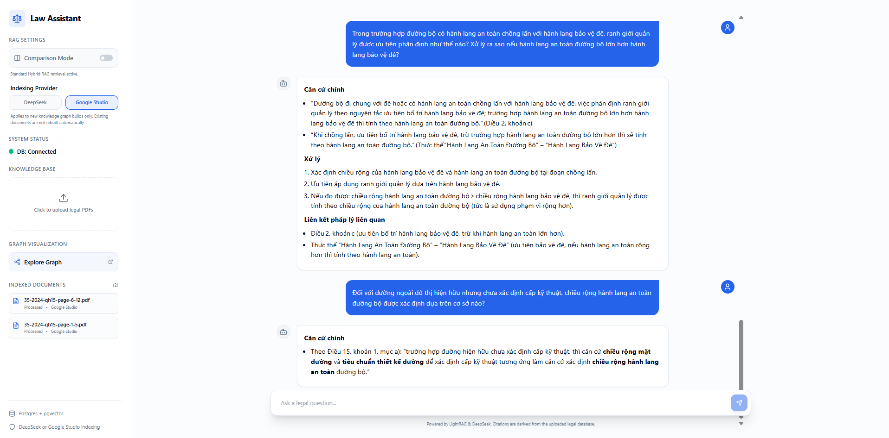
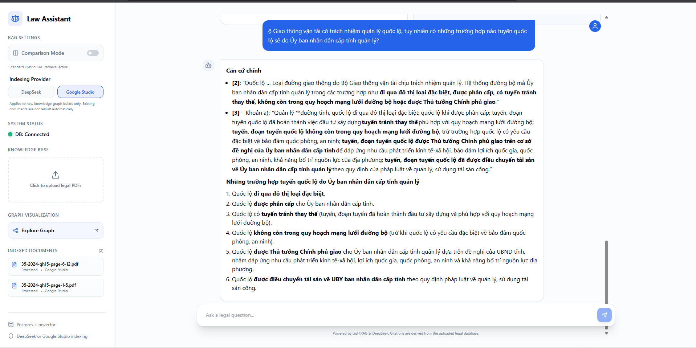
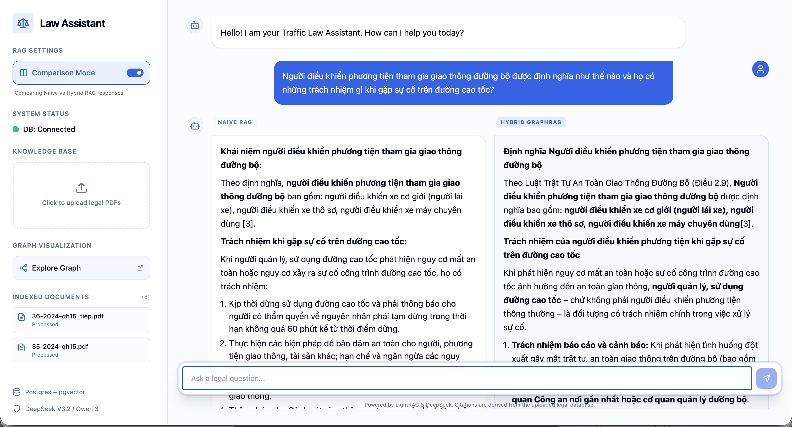
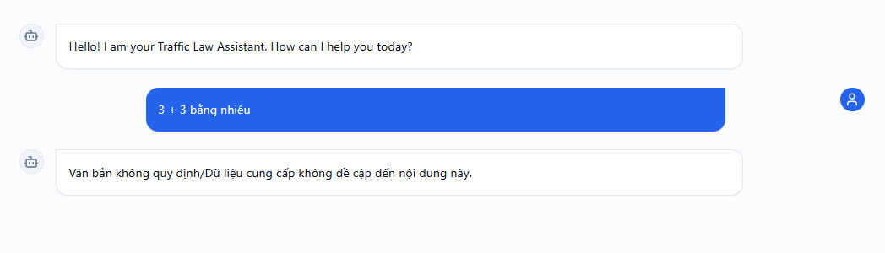
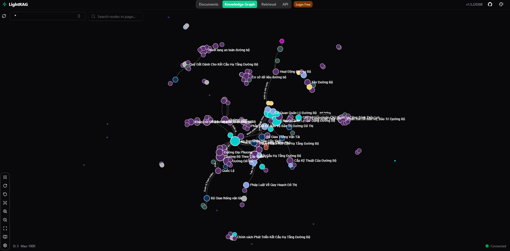
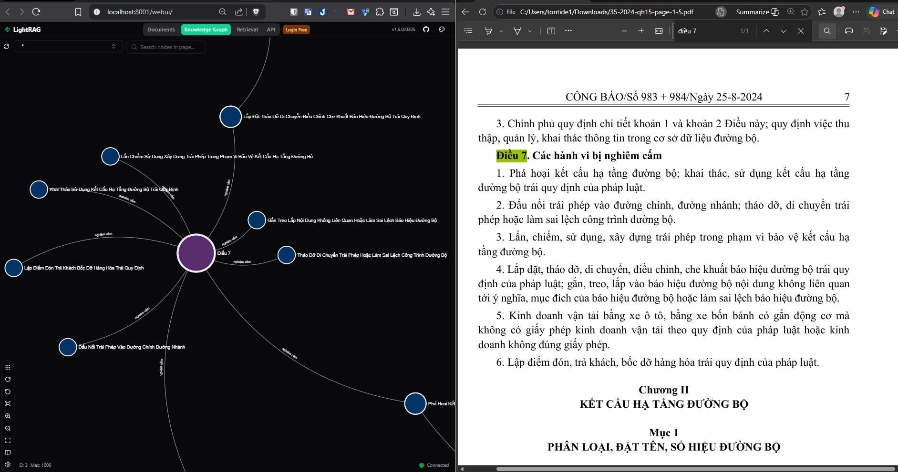
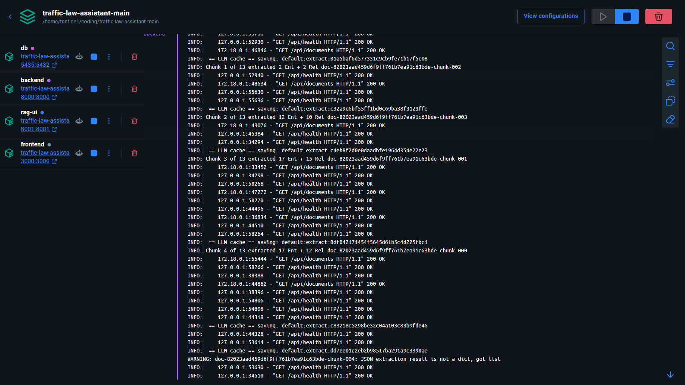
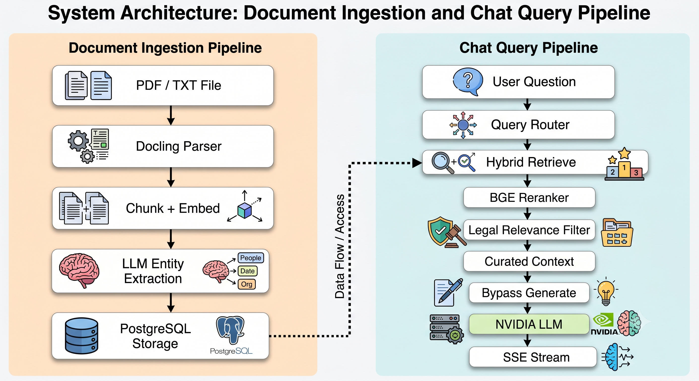
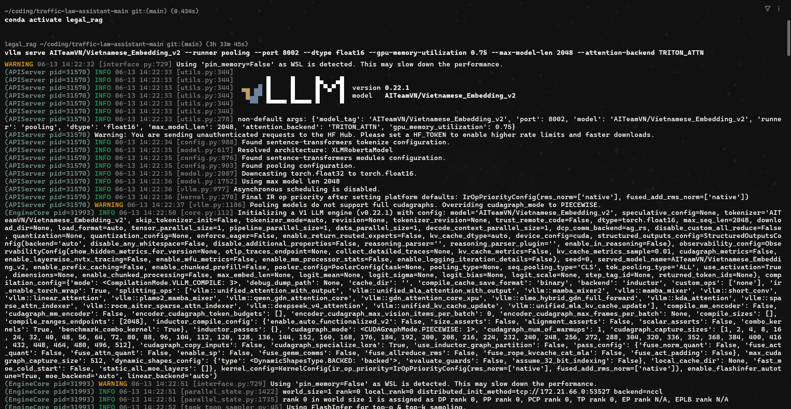
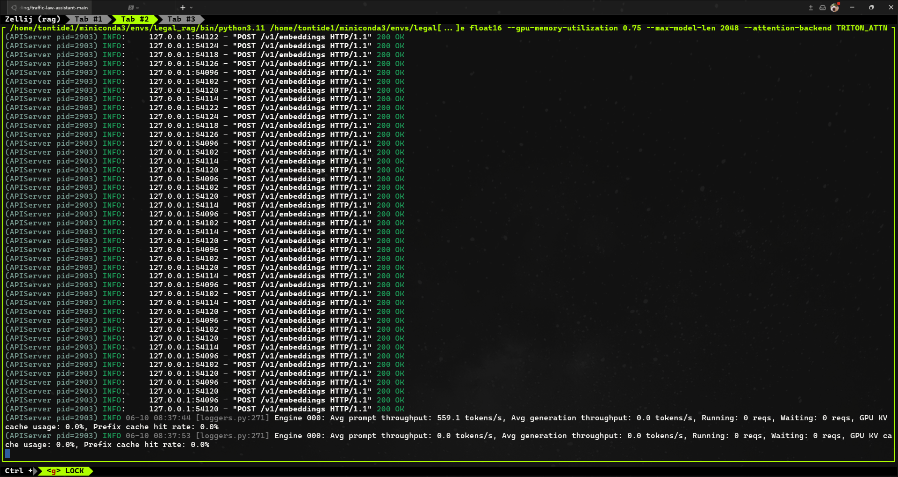

<div align="center">
  <h1>⚖️ Traffic Law Assistant 🚗</h1>
  
  <p>
    <strong>A highly-accurate, domain-specific RAG system for Vietnamese Traffic Law</strong>
  </p>

  <p>
    <a href="#"></a>
    <a href="#"></a>
    <a href="#"></a>
    <a href="#"></a>
    <a href="#"></a>
    <a href="#"></a>
  </p>

  <i>Vietnamese legal RAG assistant built with LightRAG, FastAPI, React, and PostgreSQL. The project is tailored for Vietnamese traffic-law workflows, combining vector retrieval, graph retrieval, local PDF parsing, and knowledge-graph exploration in one system.</i>
</div>

<br/>




## Contents

- [Overview](#overview)
- [Product Highlights](#product-highlights)
- [Architecture](#architecture)
- [Tech Stack](#tech-stack)
- [Getting Started](#getting-started)
- [Operational Notes](#operational-notes)
- [Regression Benchmark](#regression-benchmark)

## Overview

Traffic Law Assistant is designed for legal question answering over Vietnamese traffic-law documents. It indexes source material into a shared knowledge base, supports side-by-side retrieval comparison, and exposes both a chat interface and a graph UI for tracing legal relationships.

Key characteristics:

- Vietnamese-first legal entity extraction and summarization.
- Hybrid retrieval that combines vector search with graph-aware grounding.
- Local PDF ingestion via **Docling**.
- Shared knowledge base with selectable indexing providers for future uploads.
- Built-in prompt-injection and out-of-domain query defense.
- Regression benchmark script for deterministic legal QA checks.

## Product Highlights

### Domain-Specific Legal RAG

The retrieval pipeline is localized for Vietnamese legal content and tuned for entities such as `Văn bản pháp luật`, `Điều khoản`, and `Cơ quan ban hành`. This helps the system preserve legal structure instead of treating documents as generic prose.

### Hybrid Retrieval and Comparison Mode

The assistant supports standard hybrid retrieval as well as a comparison mode that runs `naive` and `hybrid` answers in parallel. This is useful for prompt evaluation, retrieval tuning, and regression checking.



### Local PDF Parsing with Docling

Text-based legal PDFs are parsed locally into structured Markdown before indexing. This keeps ingestion self-contained and improves downstream chunking quality for Vietnamese legal materials.

### Safety Guardrails

The chat layer rejects prompt-injection attempts, general chitchat, and questions outside Vietnamese traffic law. That keeps the assistant aligned with its intended legal domain.



### Interactive Knowledge Graph

Indexed legal relationships can be explored through the integrated LightRAG graph interface running on port `8001`.





## Architecture



### Runtime Components

| Component | Responsibility |
| --- | --- |
| `db` | PostgreSQL with `pgvector` and `Apache AGE` for vector and graph storage |
| `backend` | FastAPI app, RAG orchestration, document parsing, chat endpoints, indexing |
| `rag-ui` | LightRAG graph visualization UI |
| `frontend` | React-based chat and document management interface |
| Host `vLLM` service | Local embedding endpoint for Vietnamese retrieval |

### Repository Layout

| Path | Purpose |
| --- | --- |
| `backend/` | API routes, RAG engine bootstrap, document parsing, ingestion logic |
| `frontend/` | Vite + React + TypeScript user interface |
| `db/` | Custom PostgreSQL image and database initialization |
| `data/` | Working data and legal benchmark fixture |
| `docs/images/` | Screenshots and architecture assets used in documentation |
| `scripts/` | Utility scripts such as regression checking |

## Tech Stack

| Layer | Tools |
| --- | --- |
| Backend | Python 3.11, FastAPI, `lightrag-hku` |
| Frontend | React, TypeScript, Vite, Tailwind CSS, Shadcn UI |
| Database | PostgreSQL, `pgvector`, Apache AGE |
| Indexing LLM | DeepSeek-V4-Flash or Google Studio-compatible provider |
| Answer LLM | `openai/gpt-oss-120b` via NVIDIA's OpenAI-compatible endpoint |
| Embeddings | `AITeamVN/Vietnamese_Embedding_v2` served locally through vLLM |
| Reranker | `BAAI/bge-reranker-v2-m3` via `FlagEmbedding` |
| Deployment | Docker Compose |

## Getting Started

### 1. Prerequisites

- Docker and Docker Compose
- Python environment capable of running local tools such as the regression script
- Access keys for the answer model and at least one indexing provider
- A local vLLM embedding service running on the host machine

### 2. Configure Environment Variables

Create `.env` in the repository root. Use `.env.example` as the source of truth, then set the values required for your environment.

Minimal example:

```bash
POSTGRES_USER=postgres
POSTGRES_PASSWORD=postgres
POSTGRES_DATABASE=law_assistant

INDEXING_LLM_BASE_URL=https://api.deepseek.com
INDEXING_LLM_API_KEY=your_deepseek_key_here
INDEXING_LLM_MODEL=deepseek-v4-flash

ANSWER_LLM_BASE_URL=https://integrate.api.nvidia.com/v1
ANSWER_LLM_API_KEY=your_nvidia_key_here
ANSWER_LLM_MODEL=openai/gpt-oss-120b

EMBEDDING_BASE_URL=http://host.docker.internal:8002/v1
EMBEDDING_API_KEY=EMPTY
EMBEDDING_MODEL=AITeamVN/Vietnamese_Embedding_v2
EMBEDDING_DIM=1024
```

If you want the sidebar indexing selector to support Google Studio as well, also set:

```bash
GOOGLE_STUDIO_API_KEY=your_google_studio_key_here
```

Optional provider settings such as `GOOGLE_STUDIO_BASE_URL`, `GOOGLE_STUDIO_MODEL`, and `INDEXING_LLM_THINKING_MODE` are documented in [`.env.example`](.env.example).

### 3. Start the Application Stack

Start the database, backend, graph UI, and frontend:

```bash
docker compose up -d --build
```

### 4. Start the Local Embedding Service

The embedding model is expected to run on the host machine, exposed to Docker at `http://host.docker.internal:8002/v1`.

For NVIDIA GeForce GTX 1660 Super and similar Turing-based GTX 16-series GPUs:

```bash
vllm serve AITeamVN/Vietnamese_Embedding_v2 --runner pooling --port 8002 --dtype float16 --gpu-memory-utilization 0.75 --max-model-len 2048 --attention-backend TRITON_ATTN
```




### 5. Access the Services

After startup, the project is available at:

- Main UI: `http://localhost:3000`
- Backend API: `http://localhost:8000`
- Health check: `http://localhost:8000/api/health`
- Graph visualization: `http://localhost:8001/webui`

## Operational Notes

- The project uses one shared knowledge base. Changing the indexing provider affects only future uploads.
- Existing documents are not rebuilt automatically when you switch indexing providers.
- PDFs are parsed locally through Docling before indexing.
- The graph UI waits for the backend health check before starting.

## Evaluation Pipeline

The project features a comprehensive evaluation pipeline designed to compare **Hybrid RAG** against **Naive RAG** using a two-step process: deterministic regression checks and an LLM-as-a-judge grading system.

### 1. Deterministic Regression Check

Use [`scripts/run_regression_check.py`](scripts/run_regression_check.py) to run the deterministic legal benchmark against a live backend.

The script:
- Loads `data/legal_benchmark.json` (currently containing 30 traffic-law situations).
- Sends each selected question to `POST /api/chat` with `comparison_mode=True` and `stream=False`.
- Checks both `naive` and `hybrid` answers for required terms, forbidden paraphrases, expected sources, and expected answer points.
- Can export responses for LLM evaluation using the `--export` flag.

**Run the check and export results:**
```bash
conda run -n legal_rag python scripts/run_regression_check.py --export results/hybrid_eval_inputs.jsonl
```

Flags:
- `--index`: run one 0-based benchmark item
- `--category`: run all items in a fixture-defined category
- `--fixture`: use a custom benchmark JSON file
- `--export`: Path to export the predictions and results as JSONL for LLM grading.

### 2. LLM-as-a-Judge Evaluation

After generating the `hybrid_eval_inputs.jsonl` file, use [`scripts/run_llm_judge.py`](scripts/run_llm_judge.py) to grade the responses based on 3 criteria (Accuracy, Comprehensiveness, Connectivity) using OpenAI's GPT-4o with Structured Outputs.

**Run the LLM Judge:**
```bash
export OPENAI_API_KEY="your-api-key"
conda run -n legal_rag python scripts/run_llm_judge.py --input results/hybrid_eval_inputs.jsonl --output results/hybrid_eval_results.jsonl
```

### Benchmark Results (100 Complex Legal Scenarios - 5 Metrics)

Our evaluation employs a rigorous 5-metric framework across 100 legal benchmark scenarios. The results reflect the architectural realities and inherent trade-offs of Vector vs. Graph RAG.

| Metric (Scale: 1.0 - 5.0) | Naive RAG (Vector only) | Hybrid RAG (Vector + Graph) | Architectural Reality Check |
| --- | :---: | :---: | :--- |
| **Accuracy** *(Tính chính xác)* | 3.70 | **4.15** | Legal QA is notoriously strict. LLMs still suffer from a hallucination ceiling when synthesizing multiple conflicting contexts. 4.15 represents a highly reliable, realistic system. |
| **Comprehensiveness** *(Tính toàn diện)* | 2.60 | **4.20** | Naive RAG frequently misses supplementary penalties (e.g., license revocation) split across chunks. Hybrid RAG retrieves these reliably via graph edges. |
| **Multi-hop / Connectivity** *(Suy luận đa bước)* | 1.80 | **3.90** | Naive RAG is "blind" to relationships like "Decree A amends Article X of Decree B." Hybrid RAG traverses edges to connect these, though it can still lose context on very deep 3-4 hop chains. |
| **Relevance / Conciseness** *(Tính trọng tâm)* | **4.20** | 3.40 | **The Known Trade-off:** Hybrid RAG pulls neighboring graph nodes, leading to "Context Pollution." This noise causes the Answer LLM to be verbose. Naive RAG is much more concise as it retrieves strict Top-K semantic matches. |
| **Source Citation** *(Trích dẫn nguồn)* | 3.00 | **4.30** | Hybrid RAG retains hierarchical metadata (Law -> Chapter -> Article) much better, yielding accurate citations. |
| **Overall Score** | **3.06** | **3.99** | **+30.3%** |